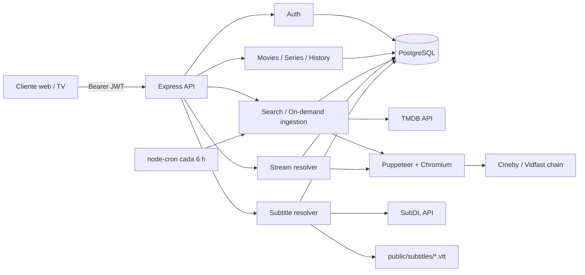

# Arquitectura actual de Kanchita Backend

## Alcance y estado observado

Auditoría de `zamzze/kanchita-backend`, rama `main`, commit `6844ef4`, realizada el 5 de septiembre de 2026. La Fase 1A añadió README y smoke test; la Fase 1B añadió las migraciones PostgreSQL descritas aquí. Siguen pendientes OpenAPI, CI y una suite funcional completa.

El sistema es un monolito Node.js/CommonJS con Express 4 y acceso directo a PostgreSQL mediante `pg`. No hay ORM. La API, el planificador de ingesta, el scraping con Chromium y el almacenamiento local de subtítulos viven en el mismo proceso/contenedor.

## Vista general

## Arranque y middleware

- `server.js` importa `src/app.js`, añade `/subtitles` como directorio estático y monta `/api/subtitles`, y abre `PORT`.
- `src/app.js` configura Helmet, CORS abierto y JSON; monta los módulos y arranca el planificador salvo con `NODE_ENV=test`.
- El manejador global de errores es el último middleware.
- El limitador global se registra **después** de las rutas, por lo que las respuestas atendidas por estas rutas no lo atraviesan. Los limitadores colocados directamente en autenticación y búsqueda sí se ejecutan.
- No existen ruta raíz, ruta de salud, manejador 404 ni apagado ordenado de HTTP/PostgreSQL/trabajos.

## Módulos

### Autenticación

`auth.controller` valida sólo presencia y longitud mínima. `auth.service` usa bcrypt (12 rondas), emite access JWT y refresh JWT, y guarda un único refresh token en texto claro en `users.refresh_token`. El access token incluye `sub`, `email` y `plan`; dura 15 minutos por defecto y el refresh 7 días. El middleware Bearer verifica el access token. Las suscripciones sólo se consultan para calcular `plan_type`; no controlan acceso ni cambian la respuesta de streams.

### Películas

Lista paginada, filtro opcional por género, detalle por UUID local y catálogo de géneros. Sólo expone filas `is_published=true`. Los detalles agregan géneros con JSON de PostgreSQL.

### Series y episodios

Lista y detalle de series por UUID local. El detalle añade temporadas calculadas desde episodios. Los episodios se listan por serie y número de temporada. No existe endpoint de detalle de episodio independiente.

### Historial

Upsert por `(user_id, content_type, content_id)`, listado cronológico y consulta de progreso. Marca completado al 90% si recibe duración. Usa una relación polimórfica hacia película o episodio sin clave foránea.

### Búsqueda e ingesta bajo demanda

Busca hasta cinco resultados en TMDB y comprueba uno por uno si ya están en el catálogo. Un detalle no existente se normaliza, se inserta y dispara en segundo plano `processMovie` o `processSeries`. Las películas intentan resolver un stream durante la ingesta; las series sólo importan temporadas/episodios.

### Streams

Acepta UUID local de película o episodio. Primero devuelve streams directos activos de PostgreSQL. Si no hay caché, abre Chromium mediante `puppeteer-real-browser`, navega por Cineby/Vidfast, observa solicitudes `.m3u8`, guarda la URL como stream directo y solicita subtítulos. El caché no tiene expiración, fecha de verificación ni invalidación por fallo.

### Subtítulos

Consulta el caché en `subtitles`, busca en SubDL, descarga ZIP/RAR en memoria, selecciona un `.srt`/`.sub`, lo convierte a WebVTT y escribe `public/subtitles/<content-id>.vtt`. Publica una URL absoluta basada en `API_BASE_URL`. La Fase 1B incorporó la tabla y la unicidad que requiere el upsert; los riesgos de red, archivos y acceso al endpoint siguen pendientes.

### Ingesta programada

`node-cron` ejecuta cada seis horas una importación de 20 películas y 10 series trending. La exclusión de ejecuciones simultáneas es una variable en memoria, válida sólo dentro de un proceso. Cada réplica de la API arrancaría su propio planificador.

## Endpoints actuales

| Método | Ruta | Auth | Función |
|---|---|---:|---|
| POST | `/api/auth/register` | No | Registrar usuario |
| POST | `/api/auth/login` | No | Emitir access/refresh token |
| POST | `/api/auth/refresh` | No | Rotar refresh token |
| POST | `/api/auth/logout` | Sí | Borrar refresh token del usuario |
| GET | `/api/movies/genres` | Sí | Listar géneros |
| GET | `/api/movies` | Sí | Listar películas (`page`, `limit`, `genre_id`) |
| GET | `/api/movies/:id` | Sí | Detalle por UUID local |
| GET | `/api/series` | Sí | Listar series |
| GET | `/api/series/:id` | Sí | Detalle y temporadas |
| GET | `/api/series/:id/seasons/:season` | Sí | Episodios de temporada |
| POST | `/api/history` | Sí | Guardar progreso |
| GET | `/api/history` | Sí | Listar historial |
| GET | `/api/history/:content_type/:content_id` | Sí | Consultar progreso |
| GET | `/api/content/search?q=&type=` | Sí | Buscar en TMDB |
| GET | `/api/content/:tmdb_id?type=` | Sí | Obtener/importar contenido |
| GET | `/api/streams/movie/:id` | Sí | Resolver stream de película |
| GET | `/api/streams/episode/:id` | Sí | Resolver stream de episodio |
| GET | `/api/subtitles/:tmdbId?type=&id=&season=&episode=` | **No** | Buscar/crear subtítulo |
| GET | `/subtitles/:file.vtt` | No | Servir WebVTT estático |

## Esquema PostgreSQL actual

| Tabla | Propósito | Claves relevantes |
|---|---|---|
| `genres` | Catálogo TMDB de géneros | `id` serial; `name`/`slug` únicos |
| `users` | Identidad y refresh token | UUID; email único |
| `subscriptions` | Plan activo | FK a usuario |
| `movies` | Metadatos de películas | UUID; `tmdb_id` único |
| `series` | Metadatos de series | UUID; `tmdb_id` único |
| `episodes` | Episodios | FK a serie; temporada/episodio único por serie |
| `content_genres` | Relación polimórfica | Sin FK para `content_id` |
| `streams` | URLs directas/embed | Sin FK; única `(content_type, content_id, server_name) NULLS NOT DISTINCT` |
| `subtitles` | Caché de URLs VTT por idioma | Única `(content_type, content_id, language)` |
| `watch_history` | Progreso por usuario | FK sólo a usuario; contenido polimórfico sin FK |
| `scraper_log` | Resultado de ingesta | Sin FK |

## Migraciones

`database/migrations/` es la fuente de verdad. El runner `database/migrate.js` aplica archivos en orden, registra checksum y fecha en `schema_migrations`, usa un advisory lock y envuelve cada migración pendiente en una transacción. `database/init.sql` incluye los mismos archivos para inicializaciones de PostgreSQL mediante Docker.

La restricción de streams usa `UNIQUE NULLS NOT DISTINCT` de PostgreSQL 15: dos valores `NULL` para el mismo contenido representan el mismo servidor lógico y activan el upsert. Si una base antigua ya contiene duplicados lógicos, la migración falla sin borrarlos para exigir una resolución explícita.

## Integraciones externas

- **TMDB:** búsqueda, trending, detalles, temporadas e IDs externos. Autenticación mediante `TMDB_API_KEY` en query string. No hay timeout, retry ni backoff.
- **SubDL:** búsqueda y descarga de archivos. `SUBDL_API_KEY`; la URL completa con clave se escribe actualmente en logs.
- **Cineby/Vidfast y un worker de terceros:** navegación automatizada y observación de playlists. La implementación depende de dominios y estructura concretos y puede romperse sin cambios locales.
- **Chromium/Xvfb:** instalados en la imagen para el flujo Puppeteer. Se ejecuta Chromium sin sandbox.

## Despliegue actual

`docker-compose.yml` define PostgreSQL 15 Alpine y API, publica 5432 y 3000, usa credenciales fijas para PostgreSQL, carga `.env` y monta el repositorio completo en `/app`. La Fase 1A corrigió `Dockerfile` y el build reproducible; la Fase 1B monta `database/` para que la inicialización consuma las migraciones. Siguen pendientes healthchecks, espera real de PostgreSQL y endurecimiento para VPS.

