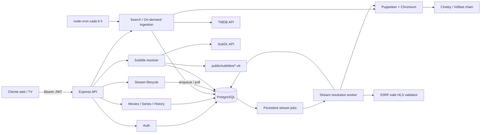

# Arquitectura actual de Kanchita Backend

## Alcance y estado observado

Auditoría de `zamzze/kanchita-backend`, actualizada desde `main` en `aadbd6e` el 5 de septiembre de 2026. La Fase 1 cerró ejecución reproducible, migraciones, CI PostgreSQL, seguridad HTTP básica y sesiones rotativas. Las Fases 2A–2B añaden lifecycle confiable y resolución asíncrona persistente para streams directos sin cambiar el proveedor existente.

El sistema usa Node.js/CommonJS con Express 4 y acceso directo a PostgreSQL mediante `pg`. No hay ORM. API y worker de streams son procesos separados que comparten código y PostgreSQL; el planificador de ingesta y el almacenamiento local de subtítulos todavía pertenecen al proceso API.

## Vista general

## Arranque y middleware

- `server.js` importa la aplicación ya configurada y abre `PORT`.
- `src/app.js` configura Helmet, allowlist CORS, JSON, VTT estáticos, limitador general antes de `/api`, módulos, 404 y errores; arranca el planificador salvo con `NODE_ENV=test`.
- El manejador global de errores es el último middleware.
- Registro y autenticación conservan un limitador más estricto; el registro está cerrado salvo `ALLOW_PUBLIC_REGISTRATION=true`.
- No existen ruta raíz, ruta de salud ni apagado ordenado de HTTP/PostgreSQL/trabajos.

## Módulos

### Autenticación

`auth.controller` conserva los contratos JSON existentes. `auth.service` usa bcrypt (12 rondas) y crea una sesión independiente por login. El access JWT incluye `sub`, `sid`, `token_type=access` y `plan`; el refresh incluye `sub`, `sid`, `jti` y `token_type=refresh`. Ambos fijan HS256, issuer y audiencias distintas, con secretos separados.

PostgreSQL almacena únicamente SHA-256 del refresh token. La renovación bloquea la fila `auth_sessions` dentro de una transacción, comprueba usuario activo, revocación, expiración y hash, y rota el token. Un hash distinto para un JWT criptográficamente válido se trata como reutilización y revoca esa sesión. Logout revoca sólo el `sid` del access token; otras sesiones siguen activas. No hay blacklist de access tokens, por lo que uno ya emitido vive hasta su expiración corta.

### Películas

Lista paginada, filtro opcional por género, detalle por UUID local y catálogo de géneros. Sólo expone filas `is_published=true`. Los detalles agregan géneros con JSON de PostgreSQL.

### Series y episodios

Lista y detalle de series por UUID local. El detalle añade temporadas calculadas desde episodios. Los episodios se listan por serie y número de temporada. No existe endpoint de detalle de episodio independiente.

### Historial

Upsert por `(user_id, content_type, content_id)`, listado cronológico y consulta de progreso. Marca completado al 90% si recibe duración. Usa una relación polimórfica hacia película o episodio sin clave foránea.

### Búsqueda e ingesta bajo demanda

Busca hasta cinco resultados en TMDB y comprueba uno por uno si ya están en el catálogo. Un detalle no existente se normaliza e inserta. Las películas crean/reutilizan un job de resolución sin invocar el proveedor desde el API; las series importan temporadas/episodios y cada episodio se encola posteriormente cuando su stream se solicita.

### Streams

Películas y episodios entran en un único flujo de lifecycle. Una fila `ready`, no expirada y verificada recientemente sale de caché. Filas `unknown`/`stale` se comprueban con un GET limitado que sólo lee el manifest y exige `#EXTM3U`; si hace falta una URL nueva, el API crea/reutiliza un job y responde `202`. El adapter del resolver sólo se invoca desde el worker y puede devolver URL, proveedor y expiración opcional; si falta expiración se aplica TTL configurable.

El validador aplica una frontera SSRF fail-closed antes de la URL inicial y de cada redirect. Resuelve todas las IP, rechaza rangos no públicos IPv4/IPv6 y entrega al socket una resolución fijada a las direcciones aprobadas. Los fixtures localhost sólo se habilitan mediante una opción inyectada explícitamente en tests; producción la deniega por defecto.

Los estados persistentes del stream son `unknown`, `ready`, `stale` y `failed`. Éxitos actualizan resolución/verificación y reinician fallos. Fallos incrementan una vez por intento y aplican backoff 30 s/2 min/5 min/15 min. Los jobs usan `pending`, `processing`, `completed` y `failed`, deduplicación mediante índice parcial, claim `FOR UPDATE SKIP LOCKED`, lease y retries 30 s/2 min/5 min. `attempt_count` sólo aumenta al claim y tiene constraint `attempt_count <= max_attempts`; recuperar un lease no cuenta como ejecución nueva. La lease mínima es timeout + 30 s. Un timeout es terminal para el job y solicita reciclar el worker porque el adapter Chromium aún no permite cancelación cooperativa. No hay una transacción abierta durante Chromium/red. El backend no descarga segmentos ni hace proxy de playback.

### Subtítulos

Consulta el caché en `subtitles`, busca en SubDL, descarga ZIP/RAR en memoria, selecciona un `.srt`/`.sub`, lo convierte a WebVTT y escribe `public/subtitles/<content-id>.vtt`. Publica una URL absoluta basada en `API_BASE_URL`. Resolver/generar mediante `/api/subtitles` requiere JWT, mientras `/subtitles/*.vtt` permanece público para el reproductor y limitado por CORS. Persisten los riesgos de red, archivos y almacenamiento.

### Ingesta programada

`node-cron` ejecuta cada seis horas una importación de 20 películas y 10 series trending. La exclusión de ejecuciones simultáneas es una variable en memoria, válida sólo dentro de un proceso. Cada réplica de la API arrancaría su propio planificador.

## Endpoints actuales

| Método | Ruta | Auth | Función |
|---|---|---:|---|
| POST | `/api/auth/register` | Flag | Registrar usuario sólo con `ALLOW_PUBLIC_REGISTRATION=true` |
| POST | `/api/auth/login` | No | Emitir access/refresh token |
| POST | `/api/auth/refresh` | No | Rotar refresh token |
| POST | `/api/auth/logout` | Sí | Revocar la sesión actual (`sid`) |
| GET | `/api/movies/genres` | Sí | Listar géneros |
| GET | `/api/movies` | Sí | Listar películas (`page`, `limit`, `genre_id`) |
| GET | `/api/movies/:id` | Sí | Detalle por UUID local |
| GET | `/api/series` | Sí | Listar series |
| GET | `/api/series/:id` | Sí | Detalle y temporadas |
| GET | `/api/series/:id/seasons/:season` | Sí | Episodios de temporada |
| POST | `/api/history` | Sí | Guardar progreso |
| GET | `/api/history` | Sí | Listar historial |
| GET | `/api/history/:content_type/:content_id` | Sí | Consultar progreso |
| GET | `/api/content/search?q=&type=` | Sí | Buscar en TMDB |
| GET | `/api/content/:tmdb_id?type=` | Sí | Obtener/importar contenido |
| GET | `/api/streams/movie/:id` | Sí | Devolver stream o `202` mientras se resuelve |
| GET | `/api/streams/episode/:id` | Sí | Devolver stream o `202` mientras se resuelve |
| GET | `/api/subtitles/:tmdbId?type=&id=&season=&episode=` | Sí | Buscar/crear subtítulo |
| GET | `/subtitles/:file.vtt` | No | Servir WebVTT estático |

## Esquema PostgreSQL actual

| Tabla | Propósito | Claves relevantes |
|---|---|---|
| `genres` | Catálogo TMDB de géneros | `id` serial; `name`/`slug` únicos |
| `users` | Identidad | UUID; email único; columna refresh legacy sin uso |
| `auth_sessions` | Sesiones refresh por cliente | UUID; FK usuario; hash, expiración, uso y revocación |
| `subscriptions` | Plan activo | FK a usuario |
| `movies` | Metadatos de películas | UUID; `tmdb_id` único |
| `series` | Metadatos de series | UUID; `tmdb_id` único |
| `episodes` | Episodios | FK a serie; temporada/episodio único por serie |
| `content_genres` | Relación polimórfica | Sin FK para `content_id` |
| `streams` | URLs directas/embed y lifecycle | Única `(content_type, content_id, server_name) NULLS NOT DISTINCT`; estado, proveedor, expiración, verificación y backoff |
| `stream_resolution_jobs` | Cola persistente movie/episode | Un job activo por contenido; estado, intentos, scheduling, lease y ownership |
| `subtitles` | Caché de URLs VTT por idioma | Única `(content_type, content_id, language)` |
| `watch_history` | Progreso por usuario | FK sólo a usuario; contenido polimórfico sin FK |
| `scraper_log` | Resultado de ingesta | Sin FK |

## Migraciones

`database/migrations/` es la fuente de verdad. El runner `database/migrate.js` aplica archivos en orden, registra checksum y fecha en `schema_migrations`, usa un advisory lock y envuelve cada migración pendiente en una transacción. `database/init.sql` incluye los mismos archivos para inicializaciones de PostgreSQL mediante Docker.

La restricción de streams usa `UNIQUE NULLS NOT DISTINCT` de PostgreSQL 15 y mantiene su semántica. La migración 003 crea `auth_sessions`; la 004 añade lifecycle; la 005 crea la cola persistente y su índice único parcial. Streams anteriores no se eliminan ni se declaran válidos: quedan `unknown`, sin verificación/expiración, para evaluación perezosa en el primer acceso.

## Integraciones externas

- **TMDB:** búsqueda, trending, detalles, temporadas e IDs externos. Autenticación mediante `TMDB_API_KEY` en query string. No hay timeout, retry ni backoff.
- **SubDL:** búsqueda y descarga de archivos mediante `SUBDL_API_KEY`; la URL con clave ya no se escribe en logs.
- **Cineby/Vidfast y un worker de terceros:** navegación automatizada y observación de playlists. La implementación depende de dominios y estructura concretos y puede romperse sin cambios locales.
- **Chromium/Xvfb:** instalados en la imagen para el flujo Puppeteer. Se ejecuta Chromium sin sandbox.

## Despliegue actual

`docker-compose.yml` define PostgreSQL 15 Alpine y API, publica 5432 y 3000, usa credenciales fijas para PostgreSQL, carga `.env` y monta el repositorio completo en `/app`. La Fase 1A corrigió `Dockerfile` y el build reproducible; la Fase 1B monta `database/` para que la inicialización consuma las migraciones. Siguen pendientes healthchecks, espera real de PostgreSQL y endurecimiento para VPS.

